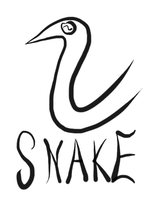
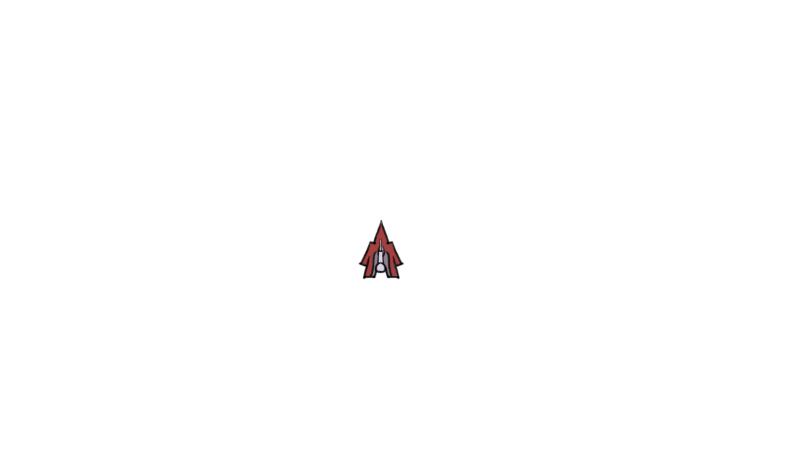

# Snake Engine



## About
Snake Engine is a 2D game engine using SDL and OpenGL. The engine provides
a framework for building basic games.

## Requirements

### Runtime
* OpenGL >= 3.2
* GLEW
* SDL2
* SDL2_image
* RapidXml

### Development
* CMake >= 3.1
* Boost

## Building and Running
To build the tests and demo from the root directory:

```
mkdir build
cd build
cmake ..
make
```

### Tests
Once built tests can be run from the `build` director with:

```
make test
```

### Demo
Once built the demo can be run from the `build` directory with:

```
./demo
```

## Using the Engine



Following is an introduction to how the engine works and how to use it with
example code from the basic demo provided. The source code for the demo can be
found in the `demo` directory. The demo has the player control a spaceship
with a rotatable turret attached on top. The spaceship can be controlled
with `a`, `d` and `w`. The turret can be rotated with the left and right
arrow keys.

### Nodes
Each game object in the Snake Engine is a node in the scene graph. The scene
graph is a tree that represents the current game state. Each node has
a transformation representing its current translation, rotation and scale.
A node's global transform is equal to its own transform combined with the
transformation of its parents in the scene graph back up to the root. 
This means a node's children's transformations are relative to its own 
transformation.  This is useful for defining relationships between game 
objects. Furthermore, the scene graph determines the order
that nodes are rendered, each child is rendered in front of its parent.

The demo involves a turret attached to a spaceship. This is a classic example
of where the scene graph can be useful. The spaceship node attaches the
turret node as a child. Then, whenever the spaceship moves, the turret
automatically moves and rotates with it as the scene graph ensures that the 
turret's position is always relative to the ship.

### Components
On its own each node just consists of an arbitrary transformation. Logic and
actions can be added to a node through components. In the demo there
are three components. The `ShipComponent` defines behaviour unique to the spaceship
body and the `TurretComponent` defines behaviour unique to the turret. The 
`RotationComponent` defines rotation actions used by both the ship body and
the turret. To define a valid component, it must be a subclass of the
`snk::Component` class. Following is a description of what a component should
include using the `ShipComponent` defined in `ship.cpp` as an example.

Each component requires a `reset` function that reinitialises the component's members.
The Snake Engine uses object pools to store components and nodes. This storage strategy
attempts to reduce dynamic allocation of memory by reusing objects. So that objects can
be reused, the `reset` function is required to be used in place of the object's constructor
when it is reused. In the case of the ship component all that needs initialised is
its speed and setting a flag representing whether the ship is currently boosting.

```cpp
ShipComponent::ShipComponent()
: mSpeed(0.f),
  mBoost(false) {}


void ShipComponent::reset() {

    mSpeed = 0.f;
    mBoost = false;
    
}
```
Components can optionally implement an `init` function that is called just after the node
the component is part of has been constructed (all of its components have been attached).
This allows the component to carry out any initial actions on the node or other components.
The component cannot carry out these operations involving its owner node in its constructor
or `reset` function as when each of them are called the component has not yet been bound to 
its owner node.

The ship component uses the `init` function to set the texture texture clip, initialise
the node's translation and attach a turret node as a child.

```cpp
void ShipComponent::init() {

    getOwner().setClip(clip::Ship::Body);
    getOwner().setOrigin(40.f, 50.f);
    getOwner().setTranslation(600.f, 400.f);
    addChild(node::Id::Turret);

}
```

Components may also optionally implement an `update` function. As the game loops this function
is used to update the component's state. The parameter `delta` passed to update is the
time passed in seconds since the last update so that the component can update its state
relative to how much time has passed.

The `ShipComponent` updates itself by first accelerating if it is currently boosting.
It updates its position by moving forward at its current rotation based on its current 
speed. Lastly, the ship decelerates.

```cpp
void ShipComponent::update(float delta) {

    // Accelerate if boosting.
    if (mBoost) {

        mSpeed += SHIP_ACCELERATION * delta;
        if (mSpeed > SHIP_MAX_SPEED) {

            mSpeed = SHIP_MAX_SPEED;

        }

    }

    // Update position based on speed and rotation.
    snk::Transform r;
    r.rotate(getOwner().getRotation());
    snk::Vector2f velocity(0.f, -mSpeed);
    velocity = r * velocity;
    getOwner().translate(velocity);

    // Decelerate.
    mSpeed -= SHIP_DECELERATION * delta;
    if (mSpeed < 0.f) {

        mSpeed = 0.f;

    }

}
```

Finally, the `ShipComponent` defines an action unique to this component with the 
`setBoost` function to set whether or not the ship is boosting forward.

```cpp
void ShipComponent::setBoost(bool boost) {

    mBoost = boost;

}
```

### Identifiers
Identifiers for nodes and components (and more or less everything in the Snake Engine)
are just indices. This can make it difficult to keep track of what code does
and which nodes and components have which ID. Therefore it is recommended to use
enumerations of each ID to make code clearer. The `demo/identifiers.hpp` file
shows an example of how this can be done. For example, each node identifier
to be used is defined in an enum:

```cpp
namespace node {

enum Id : snk::NodeId {

    Ship,
    Turret,
    Count

};

}
```

Now the turret node can be registered and referenced with `node::Id::Turret` instead
of `1`. Furthermore, by defining count as the last enumeration, it will be converted
to the total number of different nodes. This is useful when initialising the Engine
as it must be initialised with the total different types of nodes, components, textures etc.

### Textures
In order to display game objects, textures are required to display them. By default,
the engine expects textures to be in the `res/texture` directory. Each texture
requires an accompanying XML file defining properties of the texture. The XML
file must define the relative path of the image to use for that texture and may
optionally define any number of clips. Each clip defines a rectangular area within
the image. When rendered, a clip is specified and that area of the image is rendered.
The demo uses just one image `ship.png` that is a spritesheet containing both the ship
body and the turret. The file `ship.xml` defining the texture properties looks like this:

```xml
<texture path="ship.png">
    <clip left="0" top="0" width="80" height= "100"/>
    <clip left="80" top="0" width="30" height= "60"/>
</texture>
```

It defines the image path `ship.png` and two texture clips. Each clip is defined
by a rectangle (the top left corner followed by width and height). The
first clip defines the location of the ship body in the image and the
second clip defines the location of the turret. Note that
the coordinate system in Snake has the origin in the top left corner with the
positive Y axis stretching down towards the bottom of the screen.

As with components and nodes, each clip identifier is just an index and
can be more easily used in code by defining an enum to match the texture clips:

```cpp
namespace clip {

enum Ship : snk::ClipId {

    All,
    Body,
    Turret,
    Count

};

}
```

The order clips are defined in the XML file determines their ID. However,
no matter how many clips are defined, the clip with ID 0 is always the
entire unclipped image.


### Input handling
In addition a scene graph each scene requires an object to manage input and
translate it into actions in the game. Each input handler must be a subclass
of `snk::InputHandler`. The `Input` class in `demo/inputhandler.cpp`
is an example input handler. All input classes must define a `handleEvent`
function. Some of the `handleEvent` function for the demo can be seen here:

```cpp
void Input::handleEvent(const SDL_Event& event, snk::CommandQueue& queue) {

    if (event.type == SDL_KEYDOWN) {

        switch (event.key.keysym.sym) {

            case SDLK_w:
                queue.push(boostCommand(true));
                break;
```

`handleEvent` takes an event as defined by the SDL library and translates
them into `Command` objects that can be understood by the game. These
commands are added to the `CommandQueue` which holds all the commands
that need to be processed in the current game scene. For example,
in the above snippet when the `w` key is pressed, a command causing
the spaceship to boost is added to the queue. That command is
defined as follows:

```cpp
snk::Command Input::boostCommand(bool boost) {

    auto c =
    [boost](ShipComponent& ship) {

        ship.setBoost(boost);

    };
    return snk::createCommand<ShipComponent>(component::Id::Ship, c);

}
```

Each command takes a component type then carries out some kind of action on it.
The command also needs the identifier of the component type to be executed upon.
As user defined components are registered in the scene at runtime components
are all internally referenced with the `snk::Component` type so must be downcast
to the specific component type before the command can be carried out. So that the
user does not need to manually downcast from `snk::Component` every time they define
a command, the useful `snk::createCommand` is provided. By passing this function
a component identifier and a function operating on a specified component type
it will generate a command that will execute only on components with the
specified identifier and will carry out the provided function on those components
after downcasting.

### Tying everything together
Once everything has been defined the engine must be initialised and run. In the
demo this is done in `demo/main.cpp` file.

First a `snk::Game` object must be defined and initialised with how many types
of textures, input handlers, components, nodes and scenes it must be prepared
to handle. This is where the `Count` field of the enum identifiers is useful.

```cpp
    snk::Game game(texture::Id::Count,
                   iHandler::Id::Count,
                   component::Id::Count,
                   node::Id::Count,
                   scene::Id::Count);
```

Next, the textures, input handlers and components are registered with their corresponding
identifiers.

```cpp
    // Register textures.
    game.registerTexture(texture::Id::Ship, "ship.xml");
    
    // Register Input handler.
    game.registerIHandler<Input>(iHandler::Id::Input);
    
    // Register Components.
    game.registerComponent<ShipComponent>(component::Id::Ship);
    game.registerComponent<TurretComponent>(component::Id::Turret);
    game.registerComponent<RotationComponent>(component::Id::ShipRotation);
    game.registerComponent<RotationComponent>(component::Id::TurretRotation);
```

Nodes must be registered with the `snk::NodeData` struct that defines a node's texture
and components.

```cpp
    // Register ship node.
    snk::NodeData nData;
    nData.hasTexture = true;
    nData.textureId = texture::Id::Ship;
    nData.components.push_back(component::Id::Ship);
    nData.components.push_back(component::Id::ShipRotation);
    game.registerNode(node::Id::Ship, nData);
```

Finally, the scene must be initialised with the input handler to use and the node
to act as the root in its scene graph. Similar to nodes, the scene properties are
defined with the `snk::SceneData` struct. The scene is then set as the initial scene.

```cpp
    snk::SceneData sData;
    sData.rootId = node::Id::Ship;
    sData.iHandlerId = iHandler::Id::Input;
    game.registerScene(scene::Id::Scene, sData);
    game.setInitialScene(scene::Id::Scene);
```

While just a single scene is used in this example, the engine supports multiple
scenes and transitions between them.

Finally, the game can be run.

```cpp
    game.run();
```

## Future features
Currently work if focused on refining how the engine manages nodes, textures and components and
communication between them. 

## Acknowledgements
SDL2 cmake scripts used from: https://github.com/tcbrindle/sdl2-cmake-scripts
